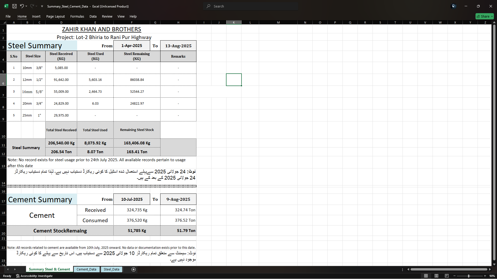

# 🏗 Steel & Cement Summary

This repository contains the **Summary_Steel_Cement_Data.xlsx** file, documenting daily steel and cement usage for the **Lot-2 Bhiria to Rani Pur Highway Project**.

## 📊 Contents
- Steel usage reports (10mm, 12mm, 16mm, 20mm, 25mm bars)
- Cement consumption logs (A3, B Class, Lean, etc.)
- Daily balances and remarks
- Records available from **July 2025 onward**

## 📷 Preview

## 🏗 Project Info
- **Company:** Zahir Khan and Brothers  
- **Project:** Lot-2 Bhiria to Rani Pur Highway  
- **Data Period:** July 2025 – August 2025  
- **Notes:** No records exist prior to July 2025